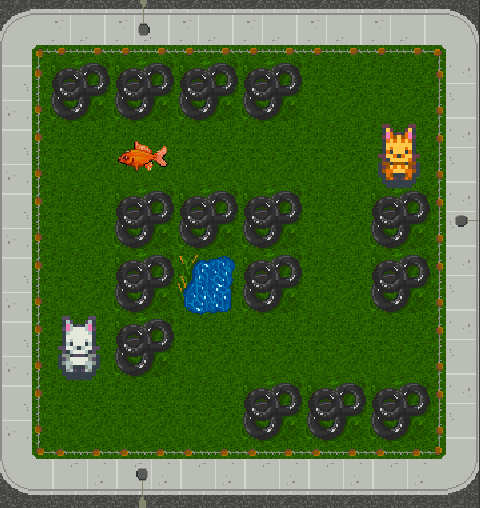
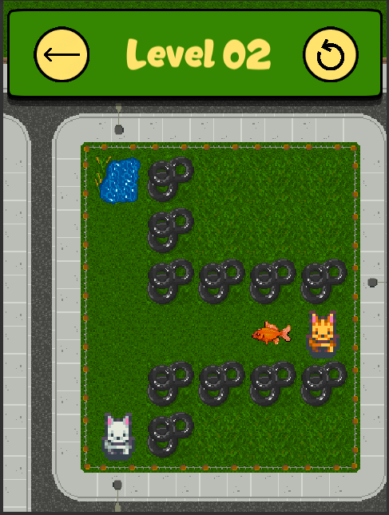
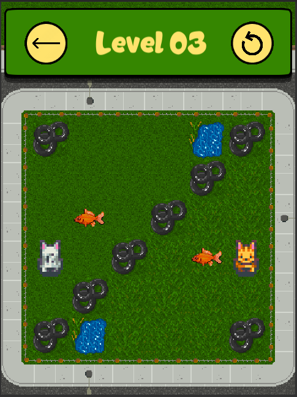

# Socoopban
*An unofficial entry for the Weekly Game Jam #136*

*Pssh: Did you know you can [play it here?](https://paxncho1.itch.io/socoopban "Itch.io")*

## About

Socoopban is a game that a made in a couple of days for the Weekly Game Jam, and then completely forget about the deadline I had upon me... But since I didn't want to waste my work, I publish it unofficially for anyone! :D

A very... **very** simple game where you control two kitties who wants to help the fishes get back to their ponds *(Weird, right?)*

## Controls

Use the arrows, WASD, or click/touch the screen to move the kitties.

## GitHub

This repo contains every code I made for the project, since is very simple is quite easy to understand all.
Each scene is its own level, the tiles and the objects are manually placed (Maybe do a level parser could be an interesting add-on)

This game was made using Unity 2019.3.0f6

## Credits

All props belong to their respective owners.... but that's lame to put, so let's credit everyone's asset.

* **Tiles:** [Backyard Top-Down Tileset](https://assetstore.unity.com/packages/2d/environments/backyard-top-down-tileset-53854) by Kittens and Elves at Work
* **Sprites:** [Cat and Dog Sprites](https://www.kindpng.com/imgv/hTRwmhJ_cat-and-dog-sprites-pixel-dog-sprite-sheet/) by Hiroko M
* **Sfx:**
    * [Otis Meow](https://freesound.org/people/blimp66/sounds/397661/) by blimp66
    * [Lucky Meowing](https://freesound.org/people/konstati/sounds/478733/) by konstati
    * [Kitty Meow](https://freesound.org/people/Npeo/sounds/203121/) by Npeo
* **Code, Level Design and UI:** [The one talking here](https://twitter.com/paxncho1)

## Final Words

Doing little games from time to time is quite fun, and put the time to take some screenshot and make some promo art to share with others is even funnier!

Don't be afraid of hit me on [Twitter](https://twitter.com/paxncho1) if you need anything :)